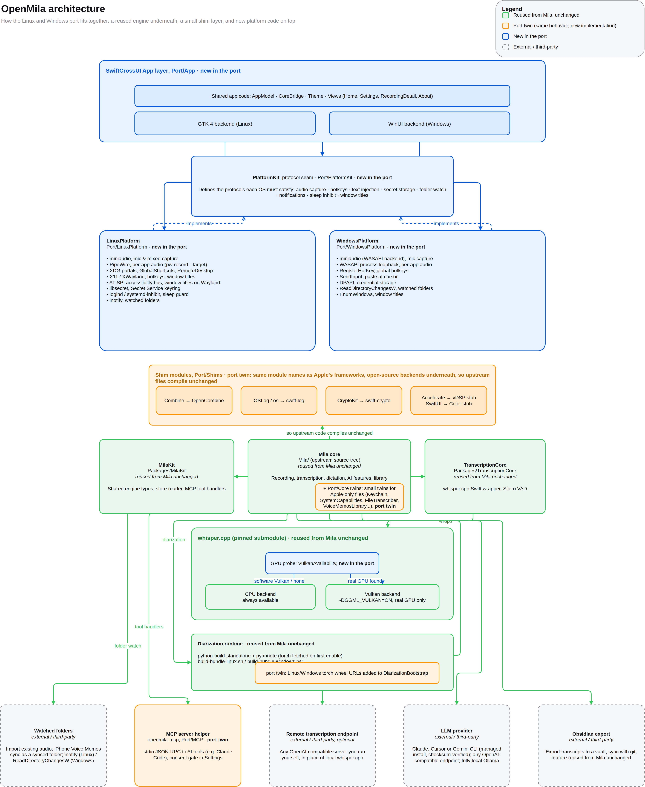

# OpenMila

OpenMila brings [Mila](https://github.com/island-io/mila), the local
transcription app for macOS, to **Linux desktop** and **Windows**. Same
features, same models, same on-device privacy: recording, dictation, Hebrew
and English transcription with whisper.cpp, speaker diarization, AI summaries,
and the MCP server for your AI tools. Nothing leaves your machine unless you
point it at a server of your own.

Website: [openmila.nx1xlab.dev](https://openmila.nx1xlab.dev)

> OpenMila is an independent community port of Mila for Linux and Windows.
> It is not affiliated with or endorsed by Island Technology, Inc.

**On a Mac, use the original:** [island-io/mila](https://github.com/island-io/mila).
OpenMila does not build for macOS and does not try to.

## Status
What is left is the part only you can do: install +port.3 on both machines and use it. On Windows there should be no admin prompt, no console window, and the app should actually open this time. If anything goes wrong, the app writes to %LOCALAPPDATA%\OpenMila\logs on Windows and ~/.local/state/openmila/logs on Linux - that log is the fastest route to a diagnosis.
Early development, not yet released. Follow the
[releases page](https://github.com/NX1X/OpenMila/releases) for the first
Linux beta.

**Linux** is where the work happens: recording, transcription, diarization,
dictation, AI summaries, the MCP server, per-application audio capture, the
AppImage and the `.deb` all run day to day on Ubuntu 26.04.

**Windows** builds and passes its tests in CI on `windows-2025` - the core,
the CLI, the MCP helper, the app on the WinUI backend and a portable zip - but
nobody has run any of it on a Windows desktop yet. Treat it as untested.

[`docs/port/PARITY.md`](docs/port/PARITY.md) tracks every Mila feature with a
per-system status and the evidence behind it, including what is still missing.
[`docs/port/LOCAL-AI.md`](docs/port/LOCAL-AI.md) covers the one-button local AI
setup, a port-only feature.
[`docs/port/ROADMAP.md`](docs/port/ROADMAP.md) is the ordered list of what still
stands between the current build and full parity, and what done means for each.

## Architecture

Top to bottom: the app layer is new; PlatformKit and its two platform
implementations are new; the shim modules are twins that let upstream Apple
imports compile unchanged; the core engine, MilaKit, TranscriptionCore,
whisper.cpp and the diarization runtime are reused from Mila unchanged (with a
few small twins called out); and the bottom row is what the app talks to
outside the process. Full source: [docs/architecture.drawio](docs/architecture.drawio).

## Credits

Mila was created by [Uri Harduf](https://github.com/urisland) at
[Island](https://www.island.io/) and released under the Apache License 2.0
at [github.com/island-io/mila](https://github.com/island-io/mila). OpenMila reuses Mila's
transcription engine, data model and application logic unchanged wherever the
platform allows, and re-implements only what is tied to macOS. The list of
upstream files this port modifies is in [CHANGES.md](CHANGES.md). Mila's
own README, with its feature list, requirements and changelog, is kept
verbatim at [docs/upstream/MILA-README.md](docs/upstream/MILA-README.md)
and refreshed on every upstream sync.

OpenMila is built with [Dagger](https://dagger.io).

## Versioning

OpenMila follows Mila's releases. Each OpenMila version is a port of one Mila
version, named `<mila version>+port.<n>`: `1.9.5+port.1` is Mila 1.9.5, first
port build. Features, models and engine pins track upstream; the port adds
platform code, not features. The Mila version currently matched is in
[`UPSTREAM_VERSION`](UPSTREAM_VERSION).

## Documentation

- [Installing and using OpenMila](docs/openmila/INSTALL.md)
- [Installing, upgrading and uninstalling](docs/port/INSTALL.md): the Windows
  installer and the Linux packages, and what an uninstall keeps
- [Using OpenMila with Claude (MCP)](docs/openmila/MCP.md)
- [Remote transcription](docs/openmila/REMOTE_SERVER.md): using your own
  server, with Mila's server guides and the few app-side differences
- [Contributing](CONTRIBUTING.md), [Security policy](SECURITY.md),
  [Repository layout](docs/port/LAYOUT.md)

## Building on Linux (developers)

Ubuntu 26.04, Swift 6.4.0, whisper.cpp from the pinned submodule. See
[`ci/README.md`](ci/README.md); `ci/run.sh all` builds and tests everything
the way CI does.

## Contact

The best way to reach the maintainer is this repository: open an
[issue](https://github.com/NX1X/OpenMila/issues) for bugs and requests, or a
[discussion](https://github.com/NX1X/OpenMila/discussions) for questions.
Security problems go through
[private vulnerability reporting](https://github.com/NX1X/OpenMila/security/advisories/new).
For anything else, the contact form and social links are at
[nx1xlab.dev/contact](https://nx1xlab.dev/contact).

## License

Apache License 2.0. See [LICENSE](LICENSE) and [NOTICE](NOTICE).
